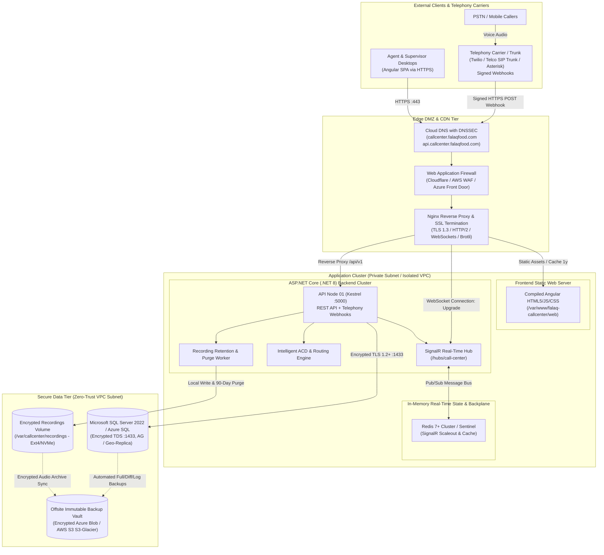
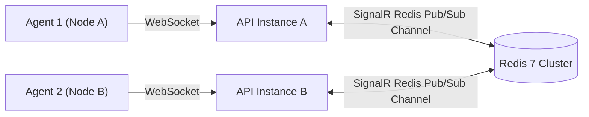
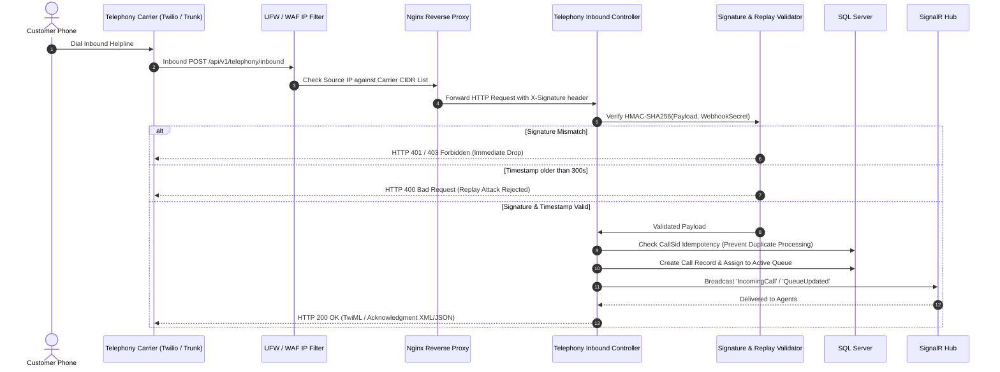
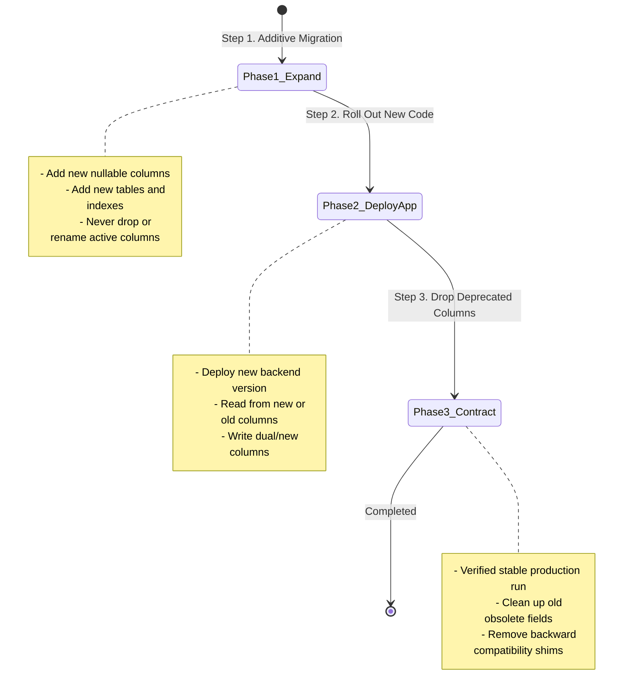

# FalaqFood Call Center - Production Setup & Infrastructure Architecture

This document provides the definitive enterprise architecture specification, high-availability topology, network security design, telephony webhook defense, database migration protocols, real-time scaling, and disaster recovery runbooks for **FalaqFood Call Center**.

---

## 1. Enterprise Architecture Topology



---

## 2. Infrastructure Component Specifications & Sizing

| Tier / Component | Technology | Target Sizing (Medium Tier) | High Availability & Scalability Strategy |
| :--- | :--- | :--- | :--- |
| **Edge Gateway / Proxy** | Nginx 1.24+ | 2 vCPU, 4 GB RAM | Dual multi-AZ load balancers with Keepalived / VRRP failover |
| **Frontend Web Hosting** | Nginx Static / Cloud CDN | Shared with Edge Gateway | Global edge caching for immutable hashed bundles (`*.js`, `*.css`) |
| **Backend API Service** | ASP.NET Core (.NET 8) | 4 vCPU, 8 GB RAM | Multi-node horizontal scale-out behind Nginx load balancer |
| **Real-Time Hub** | SignalR + Redis 7 | 2 vCPU, 4 GB RAM | Redis Sentinel or Azure Cache for Redis backplane |
| **Relational Database** | SQL Server 2022 / Azure SQL | 4 vCPU, 16 GB RAM, SSD (IOPS 3000+) | Always On Availability Groups or Azure SQL Geo-Replication |
| **Audio Storage** | Encrypted NVMe / Block Disk | 500 GB+ (expandable) | Local encrypted volume with nightly sync to object storage |
| **Log Aggregator** | Seq / Grafana Loki / ELK | 2 vCPU, 4 GB RAM | Asynchronous log shipment with 14-day retention buffer |

---

## 3. Domain, DNS & Reverse Proxy Architecture

### 3.1 Domain Topology
- **Frontend SPA**: `https://callcenter.falaqfood.com`
  - Serves static Angular HTML5, JavaScript, CSS, and localized assets.
  - Client-side routing fallback redirects all deep link paths to `/index.html`.
- **Backend API & Real-Time Gateway**: `https://api.callcenter.falaqfood.com`
  - Serves REST API endpoints (`/api/v1/*`).
  - SignalR real-time WebSocket connection endpoint (`/hubs/call-center`).
  - Telephony carrier inbound webhook receiver (`/api/v1/telephony/inbound`).
  - Health check probes (`/health/live`, `/health/ready`).

### 3.2 DNS Configuration & Protection
```text
Type    Host/Name    Value                                TTL      Proxy Status
A       @ (or www)   <EDGE_LOAD_BALANCER_PUBLIC_IP>      300      Proxied (Cloudflare)
A       api          <EDGE_LOAD_BALANCER_PUBLIC_IP>      300      Proxied (WebSockets enabled)
CAA     @            0 issue "letsencrypt.org"           Auto     DNS Only
```
- **DNSSEC**: Enabled on the registrar to prevent DNS spoofing and cache poisoning.
- **WebSocket Flag**: When using Cloudflare or cloud WAF, verify WebSockets are explicitly toggled **ON** under Network settings.

### 3.3 Nginx Reverse Proxy Architecture
Nginx terminates public SSL/TLS, applies rate limits, offloads gzip/brotli compression, proxies REST requests to Kestrel, and manages persistent WebSocket connections for SignalR.

Key architectural characteristics:
- **WebSocket Upgrade Map**: Maps `$http_upgrade` and `$connection_upgrade` to forward standard HTTP 101 Switching Protocols headers.
- **Buffer Optimization**: `proxy_buffering off;` and `proxy_cache off;` configured explicitly on `/hubs/` to prevent real-time message latency.
- **Long Keep-Alive Timeout**: `proxy_read_timeout 3600s;` prevents reverse proxy disconnects during periods of silent agent monitoring.
- **Upload Limit**: `client_max_body_size 50M;` permits ingestion of large audio recordings and customer document attachments.
- **Security Headers**: Injects `X-Frame-Options: DENY`, `X-Content-Type-Options: nosniff`, `Referrer-Policy: strict-origin-when-cross-origin`, and `Content-Security-Policy`.

---

## 4. HTTPS, SSL/TLS & Cryptographic Hardening

### 4.1 SSL/TLS Specification
- **Protocols**: Exclusively TLS 1.3 and TLS 1.2. Older SSL 2.0, 3.0, TLS 1.0, and TLS 1.1 are strictly rejected.
- **Ciphers**: Modern forward-secrecy cipher suites:
  - `ECDHE-ECDSA-AES128-GCM-SHA256`
  - `ECDHE-RSA-AES128-GCM-SHA256`
  - `ECDHE-ECDSA-AES256-GCM-SHA384`
  - `ECDHE-RSA-AES256-GCM-SHA384`
- **Certificate Authority**: Let's Encrypt automated TLS certificates with ECDSA keys (`certbot certonly --key-type ecdsa`).
- **Automated Renewal**: Systemd timer (`certbot.timer`) executes renewal checks twice daily with pre/post reload hooks for Nginx.

### 4.2 HSTS (HTTP Strict Transport Security)
The backend and reverse proxy enforce HSTS headers:
```http
Strict-Transport-Security: max-age=31536000; includeSubDomains; preload
```
This forces all modern user agents to communicate exclusively over HTTPS, mitigating SSL-stripping man-in-the-middle attacks.

---

## 5. SignalR Scalability & Real-Time Engine

### 5.1 Protocol Negotiation & Fallbacks
1. **WebSockets (Default & Preferred)**: Bi-directional, full duplex, minimal frame overhead.
2. **Server-Sent Events (SSE)**: Unidirectional server-to-client streaming used if corporate firewalls inspect and sever WebSockets.
3. **Long Polling (Resilient Fallback)**: Periodic HTTP polling used in legacy or highly restricted proxy environments.

### 5.2 Multi-Node Redis Backplane
When scaling the API to multiple Kestrel instances behind the load balancer, SignalR instances synchronize client connection groups and broadcasts across instances using Redis Pub/Sub.



To activate the Redis backplane in `src/CallCenter.Api/Program.cs`:
```csharp
var redisConn = builder.Configuration.GetConnectionString("Redis");
if (!string.IsNullOrWhiteSpace(redisConn))
{
    builder.Services.AddSignalR()
        .AddStackExchangeRedis(redisConn, options =>
        {
            options.Configuration.ChannelPrefix = "FalaqCallCenter";
        });
}
```

---

## 6. Telephony Inbound Webhook Security

Telephony carriers (e.g., Twilio, Telco SIP trunks, Asterisk) dispatch real-time call notifications (`ringing`, `answered`, `dtmf`, `completed`) to `POST /api/v1/telephony/inbound`.

### 6.1 Defense-in-Depth Webhook Pipeline



### 6.2 Security Rules
1. **Strict Carrier IP Whitelisting**: Configure UFW / Nginx to restrict access to `/api/v1/telephony/inbound` solely to known telephony provider CIDR ranges.
2. **HMAC-SHA256 Signature Verification**: Each incoming request must provide a valid cryptographic signature computed with the shared secret stored in `Telephony:WebhookSecret`.
3. **Replay Window Enforcement**: Requests carrying timestamps drift exceeding 300 seconds are rejected.
4. **Idempotent Transaction Handling**: Inbound events record their carrier `CallSid` or `EventId` with unique database constraints to prevent duplicate call creation upon carrier retries.

---

## 7. SQL Server Hardening & Database Migration Strategy

### 7.1 Database Hardening Matrix
- **Network Isolation**: The SQL Server instance listens only on a private internal interface (`10.0.x.x` or loopback) and is strictly firewalled from the public internet.
- **Enforced Transport Encryption**: All connection strings declare:
  ```ini
  Encrypt=True;TrustServerCertificate=False;
  ```
  Ensuring all queries, credentials, and customer data in transit are encrypted via TLS.
- **Least-Privilege Application User**: The application service connects as `FalaqCallCenterApp` with permissions restricted to data reading, writing, and executing stored procedures—never `sysadmin` or `db_owner`.

### 7.2 Zero-Downtime Migration Strategy (Expand and Contract)
To deploy database schema updates without system outages:



### 7.3 Migration Execution Tooling
Production schema migrations are executed via **EF Core Standalone Migration Bundles**:
- A single, self-contained native executable (`efbundle`) generated during the CI build.
- Does not require the .NET SDK on the target database server.
- Executes within an atomic database transaction.
- Supports dry-run SQL script generation for DBA review:
  ```bash
  dotnet ef migrations script --idempotent --output /tmp/migration.sql
  ```

---

## 8. Logging, Observability & Structured Auditing

### 8.1 Structured Logging Architecture
Logs are formatted as structured JSON containing contextual metadata:
- `TraceId` / `CorrelationId`: Propagated from Nginx through API requests to SignalR hubs and database transactions.
- `UserId` & `AgentId`: Extracted from authenticated claims for complete audit tracking.
- `Environment`: Labeled as `Production`.

### 8.2 Log Rotation & Retention
System logs written to `/var/log/callcenter/api.log` are managed via `logrotate`:
- Rotated daily or when exceeding 100 MB.
- Retained for 14 days with gzip compression.
- Old logs purged automatically to guarantee zero disk exhaustion incidents.

### 8.3 Central Log Aggregation Options
- **Seq**: Dedicated structured log server with instant query syntax and dashboarding.
- **Grafana Loki + Promtail**: Lightweight Kubernetes/Linux log aggregation with Grafana visualization.
- **Azure Application Insights**: Cloud-native APM with distributed tracing and failure anomaly detection.

---

## 9. Health Checks & Probing Strategy

The application provides dual-tier health probes exposed at `/health/live` and `/health/ready`:

### 9.1 Probe Definitions
| Probe | Path | Evaluated Subsystems | Target Response | Usage |
| :--- | :--- | :--- | :--- | :--- |
| **Liveness** | `GET /health/live` | Web host process responsiveness, event loop | `HTTP 200 Healthy` | Systemd watchdog / Kubernetes liveness probe (restarts process if dead) |
| **Readiness** | `GET /health/ready` | SQL Server connectivity (`DatabaseHealthCheck`), disk storage writeability | `HTTP 200 Healthy` | Nginx load balancer / Cloudflare probe (stops routing traffic if DB is down) |

### 9.2 Probe Implementation Reference
In `src/CallCenter.Api/Program.cs`:
```csharp
// Liveness: returns 200 OK immediately if the Kestrel process is alive
app.MapHealthChecks("/health/live", new HealthCheckOptions
{
    Predicate = _ => false
});

// Readiness: executes all registered health checks tagged with "ready" (e.g. DatabaseHealthCheck)
app.MapHealthChecks("/health/ready");
```

---

## 10. Automated Backup & Disaster Recovery Runbook

### 10.1 Backup Schedule & Policy
| Backup Type | Execution Schedule | Retention Window | Target Destination |
| :--- | :--- | :--- | :--- |
| **Full Database Backup** | Daily at 01:00 UTC | 30 Days | Primary Backup Volume + Offsite S3/Azure Blob |
| **Differential Backup** | Every 6 Hours | 7 Days | Primary Backup Volume + Offsite Cloud Sync |
| **Transaction Log Backup** | Every 15 Minutes | 7 Days | Primary Backup Volume + Continuous Log Shipping |
| **Call Recording Files** | Continuous / Daily Sync | 90 Days (Per Policy) | Immutable Cloud Object Storage (S3 / Blob) |

### 10.2 Recovery Targets
- **Recovery Point Objective (RPO)**: $\le 15$ Minutes (maximum potential data loss from catastrophic host failure).
- **Recovery Time Objective (RTO)**: $\le 60$ Minutes (maximum time to restore database and services to standby hardware).

### 10.3 Automated Disaster Recovery Script (`/opt/scripts/backup-database.sh`)
```bash
#!/usr/bin/env bash
set -euo pipefail

TIMESTAMP=$(date +%Y%m%d_%H%M%S)
BACKUP_DIR="/var/opt/mssql/backup"
DATABASE_NAME="FalaqFoodCallCenterProd"
BACKUP_FILE="${BACKUP_DIR}/${DATABASE_NAME}_Full_${TIMESTAMP}.bak"

# 1. Execute SQL Server Full Backup with Compression & Checksum
/opt/mssql-tools18/bin/sqlcmd -S localhost -U sa -P "${SA_PASSWORD}" -C -Q "
    BACKUP DATABASE [${DATABASE_NAME}]
    TO DISK = N'${BACKUP_FILE}'
    WITH FORMAT, INIT, COMPRESSION, CHECKSUM;
    RESTORE VERIFYONLY FROM DISK = N'${BACKUP_FILE}';
"

# 2. Sync to Offsite Immutable Cloud Storage
# Example using AWS S3 CLI:
# aws s3 cp "${BACKUP_FILE}" "s3://falaq-backups-immutable/sql/${DATABASE_NAME}_Full_${TIMESTAMP}.bak" --sse aws:kms

# 3. Purge Local Backups Older than 7 Days
find "${BACKUP_DIR}" -type f -name "*.bak" -mtime +7 -delete

echo "[$(date)] Database backup successfully completed and verified: ${BACKUP_FILE}"
```
