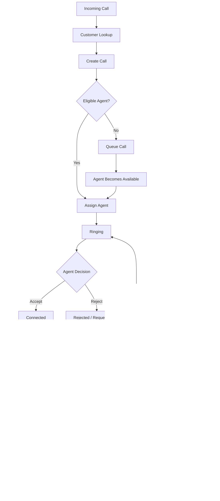

# FalaqFood Call Center Management System

<p align="center">
  
</p>

<p align="center">
  <strong>Connect. Serve. Grow.</strong><br/>
  A modern, production-oriented call center and customer operations platform for FalaqFood.
</p>

<p align="center">
  <a href="#-product-overview">Overview</a> •
  <a href="#-business-value">Business Value</a> •
  <a href="#-core-capabilities">Capabilities</a> •
  <a href="#-architecture">Architecture</a> •
  <a href="#-call-lifecycle">Call Lifecycle</a> •
  <a href="#-getting-started">Getting Started</a> •
  <a href="#-security">Security</a>
</p>

## 📌 Product Overview

FalaqFood Call Center Management System is a full-stack customer communication and call operations platform designed to help a food-service organization manage customer interactions from the first incoming call through routing, agent handling, transfer, wrap-up, recording, history, and operational reporting.

The platform combines:

- Customer Relationship Management (CRM)
- Inbound and outbound call handling
- Agent workspace and presence management
- Intelligent queue management and routing
- Real-time communication through SignalR
- Browser-based softphone / dialpad
- Call disposition and follow-up workflow
- Call recordings with controlled playback/download
- Operations dashboards and analytics
- Role-based access control and audit logging
- Twilio and simulated telephony provider abstraction

The goal is simple: give agents the right customer context, route calls to the right people, keep operations visible to supervisors, and turn every interaction into usable business data.

## 💼 Business Value

This system is designed around real call-center operational outcomes rather than only CRUD screens.

| Business Need | Platform Solution | Operational Benefit |
|---|---|---|
| Customers need quick support | Phone lookup + customer history | Faster context retrieval |
| Calls must reach available staff | Queue + routing engine | Better workload distribution |
| Supervisors need live visibility | Operations dashboard + SignalR | Faster operational decisions |
| Agents need one working area | Agent workspace + softphone | Less context switching |
| Complex calls need escalation | Blind/Warm/Supervisor transfer | Better issue resolution |
| Every interaction needs traceability | Call events + audit logs | Stronger accountability |
| Management needs performance data | Reports + analytics + exports | Data-driven decisions |
| Recordings need controlled access | Signed playback + permissions | Safer evidence and QA workflow |

### The operational loop

```
Customer
   ↓
Incoming / Outgoing Call
   ↓
Customer Identification
   ↓
Queue & Routing
   ↓
Available Agent
   ↓
Active Call Workspace
   ├── Customer Context
   ├── Notes
   ├── Hold / Resume
   ├── Mute
   └── Transfer
   ↓
Disposition & Wrap-up
   ↓
Call Timeline + Recording + Audit
   ↓
Reports & Analytics
   ↓
Better Operations
```

## ⭐ Core Capabilities

### 1. 📞 Telephony & Softphone

- Browser-based softphone and 12-key dialpad.
- Inbound and outbound call workflows.
- DTMF/audio feedback for the browser dialer.
- Telephony provider abstraction so business logic is not tightly coupled to one carrier.
- Simulated provider for development, demonstrations, and automated testing.
- Twilio Voice provider integration for real-world telephony scenarios.
- Browser Voice SDK token support.
- Telephony webhook endpoints for inbound, outbound, status, and recording events.
- Call controls for accept, reject, end, hold, resume, transfer, and recording start/stop.

### 2. 👤 Customer CRM

- Customer directory with server-side pagination.
- Search by customer name, phone number, email, and call context.
- Phone-based customer lookup.
- Customer creation, update, and deletion based on permissions.
- Customer-specific call history.
- Customer information surfaced directly inside the active call workspace.
- Duplicate/phone validation handled by the application layer.

### 3. 🧑‍💼 Agent Workspace

Agents get a focused operational workspace containing:

- Current agent identity and employee code.
- Current presence/status.
- Current active call.
- Queue visibility.
- Recent calls.
- Real-time call assignment notifications.
- Direct navigation into the active call workspace.
- Softphone access from the application shell.

Supported agent states include:

```
Offline → Available → Busy / Active Call → Wrap Up → Available
                         ↓
                       Away
```

### 4. 🧠 Queue & Intelligent Routing

The routing layer supports multiple strategies:

- Least Busy
- Priority
- Round Robin
- Skill Based
- Team Based

The default least-busy strategy considers factors such as:

- Active call count
- Calls completed today
- Last call ended time / idle ordering
- Deterministic creation-time and ID tie breakers

If no eligible agent is available, the call is placed into an active queue rather than being silently lost.

### 5. 🔄 Call Transfer

The active-call workflow supports:

- Blind Transfer
- Warm Transfer
- Supervisor Transfer
- Transfer to another eligible agent
- Transfer toward a queue where applicable
- Transfer reason/context capture

### 6. 📝 Disposition & Wrap-up

Call completion is designed as a business process, not merely a database status change.

Agents can record:

- Call disposition
- Wrap-up notes
- Follow-up requirements where applicable
- Customer interaction context

This creates a structured post-call record that can later be used by supervisors and reporting workflows.

### 7. 🎙️ Call Recording

The recording subsystem provides:

- Recording metadata management.
- Local disk storage abstraction.
- Secure playback token generation.
- Authorized streaming.
- Authorized download.
- Recording deletion controls.
- Retention configuration.
- Background retention cleanup worker.
- Recording status lifecycle.

Recording access is permission-aware, so not every role automatically receives download/delete capabilities.

### 8. 📊 Operations Dashboard & Reporting

Supervisors and administrators can access operational views covering areas such as:

- Call volume
- Call trends
- Agent status
- Queue status
- Disposition breakdown
- Period statistics
- Pending follow-ups
- Operational metrics
- Call exports

The reporting layer is implemented as application services over the domain data rather than hard-coded frontend calculations.

### 9. 🛡️ Security, RBAC & Auditability

The platform includes:

- JWT Bearer authentication.
- Role-based authorization.
- Permission-based policies.
- Admin / Supervisor / Agent role model.
- Account activation/deactivation workflows.
- Password hashing.
- Login rate limiting.
- Security headers.
- CORS policy.
- Global exception handling with trace IDs.
- SignalR authorization.
- Telephony webhook signature support.
- Audit logging for important operational actions.

## 👥 Role Model

| Capability | Admin | Supervisor | Agent |
|---|:---:|:---:|:---:|
| Sign in / use workspace | ✅ | ✅ | ✅ |
| Handle calls | ✅ | ✅ | ✅ |
| Customer view | ✅ | ✅ | ✅ |
| Create/edit customers | ✅ | ✅ | Limited by permission |
| Agent management | ✅ | ✅ | ❌ |
| Queue management | ✅ | ✅ | ❌ |
| Routing management | ✅ | ✅ | View |
| Reports & analytics | ✅ | ✅ | ❌ |
| Disposition management | ✅ | ✅ | View/use |
| User management | ✅ | ❌ | ❌ |
| System settings | ✅ | ❌ | ❌ |
| Audit logs | ✅ | ❌ | ❌ |
| Recording listen | ✅ | ✅ | Permission controlled |
| Recording download | ✅ | ✅ | ❌ by default |
| Recording delete | ✅ | ❌ | ❌ |

Authorization is implemented through both roles and granular application permissions.

## 🔁 Call Lifecycle

The central business workflow is a controlled call state machine.



### Call states

- Queued
- Ringing
- Connected
- OnHold
- Completed
- Abandoned
- Rejected
- Failed

### Why this matters

The call state is not only visual UI state. It drives business rules, agent availability, queue behavior, event generation, reporting, and the audit timeline.

## ⚡ Real-Time Event Architecture

The frontend communicates with the backend through REST APIs for transactional operations and SignalR for real-time operational events.

```
                         ┌──────────────────┐
                         │ Angular Frontend │
                         └────────┬─────────┘
                                  │
                     REST + SignalR WebSocket
                                  │
                         ┌────────▼─────────┐
                         │ ASP.NET Core API │
                         └────────┬─────────┘
                                  │
                    ┌─────────────┼─────────────┐
                    │             │             │
                 Call/Queue    Agent State   Telephony
                    │             │             │
                    └─────────────┼─────────────┘
                                  │
                         SignalR Notifications
                                  │
              ┌───────────────────┼──────────────────┐
              │                   │                  │
        Agent Workspace     Queue Monitoring    Call Workspace
```

The SignalR hub is available at:

```
/hubs/call-center
```

The real-time layer supports user, role, agent, queue, and call-oriented groups.

Representative events include:

- Incoming call
- Call assigned
- Call status changed
- Call transferred
- Agent status changed
- Queue updated
- Notifications

Automatic reconnect is configured on the Angular side.

## 🏗️ Architecture

The backend follows a Clean Architecture / layered architecture approach.

```
┌───────────────────────────────────────────────────────────────┐
│                         Angular 21 SPA                         │
│   Pages • Layout • Guards • Services • SignalR • Softphone    │
└───────────────────────────────┬───────────────────────────────┘
                                 │ HTTP / SignalR
┌───────────────────────────────▼───────────────────────────────┐
│                    CallCenter.Api (.NET 8)                     │
│  Controllers • Middleware • Auth • Health • Swagger • Hub Map │
└───────────────────────────────┬───────────────────────────────┘
                                 │
┌───────────────────────────────▼───────────────────────────────┐
│                    CallCenter.Application                      │
│  DTOs • Service Contracts • Routing Contracts • Use Cases     │
└───────────────────────────────┬───────────────────────────────┘
                                 │
┌───────────────────────────────▼───────────────────────────────┐
│                      CallCenter.Domain                         │
│  Entities • Enums • Security • Core Business Concepts         │
└───────────────────────────────▲───────────────────────────────┘
                                 │
┌───────────────────────────────┴───────────────────────────────┐
│                 CallCenter.Infrastructure                      │
│  EF Core • SQL Server • Telephony • SignalR • Storage • Auth  │
│  Routing Strategies • Reporting • Persistence • Workers       │
└───────────────────────────────────────────────────────────────┘
```

### Why this architecture is valuable

- Business rules are separated from transport concerns.
- Telephony providers can be replaced without rewriting the whole application.
- Routing algorithms are strategy-based and extensible.
- Infrastructure concerns stay outside the domain layer.
- Controllers remain thin and delegate business operations to services.
- The same application services can be tested without depending on a browser UI.

## 🧰 Technology Stack

### Backend

| Technology | Version / Role |
|---|---|
| ASP.NET Core Web API | .NET 8 |
| C# | Modern nullable-enabled C# |
| Entity Framework Core | 8.0.30 |
| SQL Server / LocalDB | Persistence |
| SignalR | Real-time communication |
| JWT Bearer | Authentication |
| Swagger / OpenAPI | Development API documentation |
| xUnit | Automated testing |
| Moq / FluentAssertions | Test support |

### Frontend

| Technology | Version / Role |
|---|---|
| Angular | 21.2.x |
| TypeScript | 5.9.x |
| RxJS | 7.8.x |
| Angular Router | SPA navigation |
| Reactive Forms | Form handling |
| @microsoft/signalr | 9.0.6 client |
| Twilio Voice SDK | 2.18.5 |
| Jasmine / Karma | Frontend testing |

### Telephony & Storage

- Twilio Voice integration
- Simulated telephony provider
- Pluggable telephony provider factory
- Local disk recording storage abstraction
- Secure playback token generation
- Automated retention cleanup worker

## 📁 Project Structure

```
FalaqFoodCallCenter/
│
├── backend/
│   ├── CallCenter.sln
│   │
│   ├── src/
│   │   ├── CallCenter.Api/
│   │   │   ├── Controllers/
│   │   │   ├── Health/
│   │   │   ├── Middleware/
│   │   │   └── Program.cs
│   │   │
│   │   ├── CallCenter.Application/
│   │   │   ├── Agents/
│   │   │   ├── Authentication/
│   │   │   ├── Calls/
│   │   │   ├── Customers/
│   │   │   ├── Queues/
│   │   │   ├── Routing/
│   │   │   ├── Telephony/
│   │   │   ├── Recordings/
│   │   │   └── Reports/
│   │   │
│   │   ├── CallCenter.Domain/
│   │   │   ├── Entities/
│   │   │   ├── Enums/
│   │   │   └── Security/
│   │   │
│   │   └── CallCenter.Infrastructure/
│   │       ├── Agents/
│   │       ├── Authentication/
│   │       ├── Calls/
│   │       ├── Customers/
│   │       ├── Persistence/
│   │       ├── Queues/
│   │       ├── RealTime/
│   │       ├── Recordings/
│   │       ├── Reports/
│   │       ├── Routing/
│   │       ├── Settings/
│   │       └── Telephony/
│   │
│   └── tests/
│       └── CallCenter.Tests/
│
├── frontend/
│   └── src/app/
│       ├── core/
│       │   ├── auth/
│       │   ├── guards/
│       │   ├── interceptors/
│       │   ├── models/
│       │   └── services/
│       ├── layout/
│       │   └── softphone-dialer/
│       └── pages/
│           ├── dashboard/
│           ├── agent-dashboard/
│           ├── active-call/
│           ├── incoming-call/
│           ├── customers/
│           ├── call-history/
│           ├── reports/
│           ├── agents/
│           ├── queues/
│           ├── users/
│           ├── audit-logs/
│           └── settings/
│
├── docs/
│   ├── TEST-STRATEGY.md
│   ├── MANUAL-E2E-TEST-SCENARIO.md
│   └── assets/
│       └── falaqfood-call-center-banner.png
│
├── DEPLOYMENT.md
├── PRODUCTION-SETUP.md
├── ENVIRONMENT-CONFIG.md
├── INTEGRATION-REVIEW.md
└── README.md
```

## 🖥️ Application Modules

The current Angular route structure includes:

| Module | Route | Primary User |
|---|---|---|
| Operations Dashboard | `/dashboard` | Admin / Supervisor |
| Agent Workspace | `/agent-dashboard` | Agent / Supervisor / Admin |
| Incoming Call Center | `/incoming-call` | Authorized users |
| Active Call Workspace | `/active-call` | Authorized users |
| Customers | `/customers` | Authorized users |
| Call History | `/call-history` | Authorized users |
| Call Details | `/call-history/:id` | Authorized users |
| Call Queues | `/queues` | Admin / Supervisor |
| Reports | `/reports` | Admin / Supervisor |
| Agent Management | `/agents` | Admin / Supervisor |
| User Management | `/users` | Admin |
| Audit Logs | `/audit-logs` | Admin |
| Settings | `/settings` | Admin |

## 🔌 API Surface

The backend exposes versioned REST endpoints under:

```
/api/v1
```

Major API areas include:

```
/api/v1/auth
/api/v1/agents
/api/v1/audit-logs
/api/v1/calls
/api/v1/customers
/api/v1/dispositions
/api/v1/queues
/api/v1/recordings
/api/v1/reports
/api/v1/routing
/api/v1/settings
/api/v1/telephony
/api/v1/users
```

### Health endpoints

```
GET /health/live
GET /health/ready
```

`/health/ready` includes the database readiness check.

### Swagger

Swagger/OpenAPI is enabled in the Development environment.

## 🗄️ Core Domain Model

The persistence model contains the major business concepts required by the workflow:

```
User
 ├── Role
 └── Agent

Customer
 └── Calls
      ├── CallEvents
      ├── CallDisposition
      ├── CallRecording(s)
      └── CallQueueEntry

CallQueue
 └── CallQueueEntry

SystemSetting

AuditLog
```

Core entities include:

- User
- Role
- Agent
- Customer
- Call
- CallEvent
- CallQueue
- CallQueueEntry
- CallDisposition
- CallRecording
- AuditLog
- SystemSetting

EF Core migrations are included in the infrastructure project.

## 🚀 Getting Started

### Prerequisites

Install:

- .NET 8 SDK
- Node.js (LTS recommended)
- npm
- SQL Server / SQL Server LocalDB for the default local configuration
- A modern Chromium-based browser for the browser softphone experience

### 1. Clone the repository

```bash
git clone <your-repository-url>
cd FalaqFoodCallCenter
```

### 2. Configure the database

The development configuration currently points to SQL Server LocalDB:

```
Server=(localdb)\MSSQLLocalDB;
Database=FalaqFoodCallCenter;
Trusted_Connection=True;
TrustServerCertificate=True;
MultipleActiveResultSets=true
```

Update `backend/src/CallCenter.Api/appsettings.json` or use environment-specific configuration when required.

### 3. Run the backend

```bash
cd backend
dotnet restore
dotnet run --project src/CallCenter.Api
```

The development API is configured for the Angular application at:

```
http://localhost:5289
```

### 4. Run the frontend

Open a second terminal:

```bash
cd frontend
npm install
npm start
```

Then open:

```
http://localhost:4200
```

### 5. Run automated tests

Backend:

```bash
cd backend
dotnet test
```

Frontend:

```bash
cd frontend
npm test -- --watch=false
```

### 6. Build the frontend

```bash
cd frontend
npm run build
```

## 🔐 Local Demo Authentication

The application seeds a default administrator in non-testing environments.

The development configuration/docs use:

```
Username: admin
Password: ChangeMe123!
```

**Important:** Change development/demo credentials before any real deployment. Never reuse development secrets in production.

Additional users and roles can be managed from the User Management screen when signed in with appropriate administrator privileges.

## ⚙️ Configuration

### Backend configuration sections

The primary configuration areas are:

- `ConnectionStrings`
- `Jwt`
- `Cors`
- `Telephony`
- `Logging`
- `RecordingStorage`

### Example development telephony configuration

```json
"Telephony": {
  "Provider": "Simulated",
  "CallbackBaseUrl": "http://localhost:5000",
  "DefaultCallerId": "+15551234567",
  "TokenTtlMinutes": 15,
  "RequireWebhookSignature": false
}
```

### Production principles

For production:

- Use environment variables or a managed secret store for secrets.
- Use a strong JWT signing key.
- Enable HTTPS.
- Configure exact CORS origins.
- Enable webhook signature validation.
- Use real telephony credentials only on the server.
- Never put carrier secrets or JWT signing keys in Angular environment files.
- Configure secure recording storage and retention.
- Review `PRODUCTION-SETUP.md` and `ENVIRONMENT-CONFIG.md` before deployment.

## 🛡️ Security

Security is treated as part of the business architecture.

### Authentication

```
Login
  ↓
JWT Access Token
  ↓
REST Authorization
  ↓
SignalR Authorization
```

JWT validation includes issuer, audience, lifetime, and signing-key validation.

### Authorization

The system defines granular permissions such as:

```
Permissions.Calls.View
Permissions.Calls.Manage
Permissions.Customers.View
Permissions.Customers.Create
Permissions.Customers.Edit
Permissions.Agents.View
Permissions.Agents.Manage
Permissions.Agents.Status
Permissions.Routing.View
Permissions.Routing.Manage
Permissions.Reports.View
Permissions.Recordings.View
Permissions.Recordings.Listen
Permissions.Recordings.Download
Permissions.Recordings.Delete
Permissions.Users.View
Permissions.Users.Manage
Permissions.AuditLogs.View
```

This allows the application to evolve beyond a simple three-role authorization model.

### Additional controls

- Login rate limiting.
- Security response headers.
- CORS restrictions.
- Global exception middleware.
- Trace IDs for server errors.
- Protected SignalR hub.
- Recording access controls.
- Telephony webhook signature infrastructure.
- Audit trail for important operational actions.

## 🧪 Quality & Testing

The repository contains a broad automated test suite covering domain behavior, services, API integration, routing, telephony, security, SignalR, recordings, reporting, and frontend services/components.

A source-level review of the delivered repository identifies:

- 262 backend test methods across the backend test project.
- 17 frontend specification files covering Angular services/components/guards/interceptors.
- Dedicated integration coverage for call lifecycle, routing, queues, telephony, reporting, authorization, audit logging, recordings, and real-time communication.

Representative test areas include:

- Authentication & Authorization
- Agent Status & Dashboard
- Customer Lookup & Management
- Call Lifecycle
- Call History
- Call Transfer
- Hold & Resume
- Queue Management
- Routing Strategies
- SignalR Real-Time Events
- Telephony Abstraction
- Twilio Integration
- Secure Call Recordings
- Reporting & Analytics
- Audit Logging
- Settings
- User Management

### Testing philosophy

```
Unit Tests
    ↓
Service / Business Logic Tests
    ↓
Integration Tests
    ↓
Real-Time / Telephony Tests
    ↓
End-to-End Critical Lifecycle
```

Test counts above describe the repository structure discovered during review; they are not a claim that this exact environment successfully executed every test. Run `dotnet test` and the Angular test command in the target development environment for the authoritative result.

## 🧩 Telephony Provider Design

Telephony is intentionally abstracted behind provider interfaces.

```
                    ITelephonyProvider
                           │
            ┌──────────────┼──────────────┐
            │              │              │
            ▼              ▼              ▼
       Simulated        Real Gateway     Twilio
        Provider          Provider       Provider
```

### Why this is a strong design choice

The call-center business layer should not care whether a call originated from a simulator, Twilio, or another future carrier.

That separation makes the platform:

- Easier to test.
- Easier to demonstrate.
- Easier to migrate between providers.
- Less coupled to third-party APIs.
- More suitable for future enterprise integrations.

## 📈 Reporting & Analytics Flow

```
Call Events
    +
Call Records
    +
Agent Activity
    +
Queue Activity
    +
Dispositions
    ↓
Report Service
    ↓
Operational Metrics
    ├── Period Statistics
    ├── Call Trends
    ├── Agent Status
    ├── Queue Status
    ├── Disposition Breakdown
    └── Pending Follow-ups
    ↓
Supervisor / Admin Dashboard
```

This architecture keeps reporting logic centralized and reusable across UI and future integrations.

## 📦 Deployment

Deployment documentation is separated from the main README for maintainability.

See:

- `DEPLOYMENT.md`
- `PRODUCTION-SETUP.md`
- `ENVIRONMENT-CONFIG.md`

A typical production topology can be represented as:

```
                    Internet
                       │
                 HTTPS / TLS
                       │
              ┌────────▼────────┐
              │ Reverse Proxy   │
              │ Nginx / Gateway │
              └────────┬────────┘
                       │
            ┌──────────▼──────────┐
            │ ASP.NET Core API    │
            │ REST + SignalR      │
            └───────┬───────┬─────┘
                    │       │
              ┌─────▼───┐   └──────────────┐
              │ SQL DB  │                  │
              └─────────┘          ┌───────▼────────┐
                                   │ Telephony       │
                                   │ Provider/Twilio │
                                   └─────────────────┘
```

For multi-node deployments, the real-time architecture can be extended with a SignalR backplane such as Redis, subject to the deployment configuration and operational requirements.

## 🧭 Recommended Production Readiness Checklist

Before exposing the system to real customers or real telephony traffic:

- [ ] Replace all development/demo credentials.
- [ ] Generate a strong production JWT signing key.
- [ ] Configure production SQL Server securely.
- [ ] Configure HTTPS and trusted certificates.
- [ ] Restrict CORS to the real frontend origin.
- [ ] Enable and validate telephony webhook signatures.
- [ ] Configure Twilio/real telephony credentials only on the server.
- [ ] Configure public callback URLs.
- [ ] Configure recording storage permissions and retention.
- [ ] Review recording download/delete permissions.
- [ ] Validate agent-to-call authorization rules for the production workflow.
- [ ] Validate real-time event targeting so sensitive caller data is only sent to intended recipients.
- [ ] Execute the complete automated test suite in CI.
- [ ] Execute the manual critical call lifecycle before go-live.
- [ ] Configure monitoring, backups, logging, and alerting.

The repository already includes an integration review documenting several areas that should be consciously validated before a production rollout. Treat that review as an engineering checklist, not as a substitute for production verification.

## 📋 Engineering Highlights

From an engineering and portfolio perspective, this project demonstrates practical experience with:

- Clean Architecture in ASP.NET Core.
- Domain-oriented business modeling.
- REST API design and versioning.
- Entity Framework Core and SQL Server.
- JWT authentication and policy authorization.
- Role/permission matrices.
- Real-time SignalR communication.
- Strategy Pattern for routing.
- Provider abstraction for telephony.
- Browser softphone integration.
- Call state-machine style lifecycle management.
- Queue prioritization and deterministic routing.
- Secure recording access.
- Background workers for retention.
- Server-side pagination and filtering.
- Operational dashboards and analytics.
- Automated unit/integration testing.
- Angular standalone application architecture.
- Responsive enterprise UI patterns.

## 🎯 Why This Project Is More Than a CRUD Application

A typical CRUD project primarily demonstrates create, read, update, and delete operations.

FalaqFood Call Center goes further by modeling a real operational workflow:

```
Business Event
     ↓
Domain State
     ↓
Business Rule
     ↓
Persistence
     ↓
Real-Time Notification
     ↓
User Action
     ↓
Next Business State
     ↓
Audit / Reporting
```

That makes the project a stronger demonstration of software engineering, system design, business analysis, integration, security, and operational thinking — not just frontend or API development.

## 🔮 Future Extension Opportunities

The current architecture leaves room for future capabilities without requiring a complete rewrite.

Potential extensions include:

- Advanced skill taxonomy and weighted skill routing.
- SLA policies and queue-level service targets.
- Workforce scheduling and shift management.
- WhatsApp/SMS customer communication.
- Email/ticket integration.
- Customer order-system integration.
- Knowledge base for agents.
- Supervisor live-monitoring and whisper/barge features.
- Advanced QA scoring over recorded calls.
- Cloud object storage for recordings.
- Distributed SignalR with Redis at scale.
- Background analytics pipelines.
- Customer satisfaction surveys.
- AI-assisted call summaries and disposition suggestions.

These are intentionally presented as extension opportunities, not as claims that they are already implemented.

## 📚 Project Documentation

| Document | Purpose |
|---|---|
| README.md | Product, architecture, workflow and setup overview |
| INTEGRATION-REVIEW.md | Integration findings and engineering review notes |
| DEPLOYMENT.md | Deployment guidance |
| PRODUCTION-SETUP.md | Production-oriented setup |
| ENVIRONMENT-CONFIG.md | Environment variables and configuration reference |
| docs/TEST-STRATEGY.md | Test architecture and QA strategy |
| docs/MANUAL-E2E-TEST-SCENARIO.md | Critical manual call lifecycle scenario |

## 👨‍💻 Project Author

**Md. Enamul Haque**

FalaqFood Call Center Management System — a full-stack software engineering project focused on customer operations, call-center workflow automation, real-time communication, secure APIs, business-rule-driven routing, and operational analytics.

## 📄 License

No LICENSE file is currently included in the delivered repository. Add the appropriate license file before publicly distributing the project if required by the intended organization, client, or repository policy.

<p align="center">
  <strong>FalaqFood Call Center</strong><br/>
  <sub>Connect • Serve • Grow</sub>
</p>
