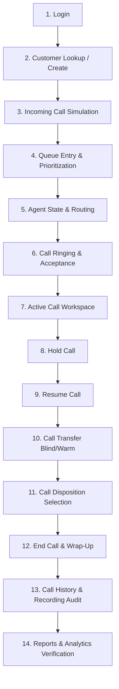

# FalaqFood Call Center - End-to-End Manual Test Scenario

## 1. Overview & Purpose
This document provides a comprehensive, step-by-step manual test scenario verifying the complete call center lifecycle for **FalaqFood Call Center**. It simulates real-world production workflows across frontend UI components, backend REST APIs, WebSockets (SignalR), telephony integration, and reporting subsystems.

---

## 2. Test Environment & Prerequisites

### 2.1 Services & Ports
- **Backend API**: `https://localhost:7082` (or configured dev port)
- **Frontend SPA**: `http://localhost:4200`
- **Database**: SQL Server LocalDB / Express with EF Core migrations applied and seed data initialized
- **SignalR Hub**: `/hubs/callcenter`

### 2.2 Test Accounts & Personas
| Role | Username | Password | Purpose |
| :--- | :--- | :--- | :--- |
| **Admin** | `admin` | `Admin@123` | System configuration, reports, all permissions |
| **Supervisor** | `supervisor` | `Supervisor@123` | Queue management, agent monitoring, transfers |
| **Agent 1** | `agent1` | `Agent@123` | Primary call handling agent (Extension: 1001) |
| **Agent 2** | `agent2` | `Agent@123` | Transfer target agent (Extension: 1002) |

---

## 3. End-to-End Test Execution Workflow



---

### Step 1: Login & Authentication
- **Target Persona**: `agent1`
- **Navigation**: Navigate to `http://localhost:4200/login`
- **Actions**:
  1. Enter Username: `agent1`, Password: `Agent@123`.
  2. Click **Sign In**.
- **Expected Results**:
  - `POST /api/v1/auth/login` returns HTTP `200 OK` with JWT token and user permissions.
  - JWT token stored securely in `sessionStorage` (`falaq_access_token`).
  - Redirected to `/agent-dashboard`.
  - SignalR connection to `/hubs/callcenter` established with active status indicator.
  - User profile displays: *Agent 1* with Agent Code `AG-1001`.

---

### Step 2: Customer Management & Lookup
- **Target Persona**: `agent1`
- **Navigation**: Click **Customers** in the main navigation menu (`/customers`).
- **Actions**:
  1. Type `01712345678` into the real-time search box.
  2. Verify search debounces (350ms) and executes `GET /api/v1/customers?search=01712345678`.
  3. If customer does not exist, click **Add Customer**:
     - **Full Name**: `Ayesha Rahman`
     - **Phone Number**: `01712345678`
     - **Email**: `ayesha.rahman@example.com`
     - **Address**: `House 12, Road 4, Dhanmondi, Dhaka`
     - **Notes**: `VIP Food Customer - frequent orders`
  4. Click **Save Customer**.
- **Expected Results**:
  - `POST /api/v1/customers` returns HTTP `201 Created`.
  - Customer modal closes; customer table updates immediately.
  - Customer profile is created with unique ID `customerId`.

---

### Step 3: Incoming Call Simulation
- **Target Persona**: External Caller via Webhook / Simulation API
- **Actions**:
  1. Post incoming telephony simulation payload via PowerShell or cURL:
     ```powershell
     # PowerShell command:
     $headers = @{
       "Content-Type"  = "application/json"
       "Authorization" = "Bearer $token"
     }
     $body = @{
       phoneNumber   = "01712345678"
       correlationId = "SIM-INBOUND-001"
     } | ConvertTo-Json

     Invoke-RestMethod -Uri "https://localhost:7082/api/v1/telephony/incoming/simulate" -Method Post -Headers $headers -Body $body
     ```
     Or using cURL:
     ```bash
     curl -X POST "https://localhost:7082/api/v1/telephony/incoming/simulate" \
       -H "Content-Type: application/json" \
       -H "Authorization: Bearer $TOKEN" \
       -d '{"phoneNumber":"01712345678","correlationId":"SIM-INBOUND-001"}'
     ```
- **Expected Results**:
  - Webhook returns HTTP `201 Created` with `callId` and status `Queued`.
  - System checks customer phone `01712345678`, automatically linking the call to `Ayesha Rahman`.
  - SignalR publishes `queue-updated` event.

---

### Step 4: Queue Assignment & Prioritization
- **Target Persona**: `supervisor` (in separate browser window) or automated router
- **Navigation**: Navigate to `/queues`.
- **Actions**:
  1. Observe the **Support Queue** card.
  2. Verify incoming call `SIM-INBOUND-001` appears in the queue entries list.
  3. Click **Increase Priority** on the entry if expedited handling is required.
- **Expected Results**:
  - `GET /api/v1/queues/summary` updates waiting call count via SignalR `queue-updated` event.
  - Wait duration increments in real-time on UI ticker without page reload.

---

### Step 5: Agent State & Routing Notification
- **Target Persona**: `agent1`
- **Actions**:
  1. On `/agent-dashboard`, ensure status is set to **Available**.
  2. The routing engine assigns the queued call to `agent1`.
- **Expected Results**:
  - SignalR broadcasts `incoming-call` event to `agent1`.
  - An audio chime rings and an **Incoming Call Notification Modal** pops up with:
    - Caller Name: `Ayesha Rahman`
    - Phone: `01712345678`
    - Direction: `Inbound`
    - VIP / Notes badge

---

### Step 6: Accept Call
- **Target Persona**: `agent1`
- **Actions**:
  1. Click the green **Accept Call** button on the incoming banner/modal.
- **Expected Results**:
  - Call status updates to `Connecting` -> `Connected`.
  - Telephony API receives `POST /api/v1/telephony/calls/{callId}/answer`.
  - Agent status changes from `Available` to `OnCall`.
  - UI automatically navigates to `/active-call`.

---

### Step 7: Active Call Workspace Interaction
- **Target Persona**: `agent1`
- **Navigation**: `/active-call`
- **Actions**:
  1. Verify live timer starts counting up (`00:00:01`, `00:00:02`, etc.).
  2. Customer details panel shows *Ayesha Rahman*, phone number, and previous call history.
  3. In the **Call Notes** textarea, enter:
     `"Customer inquired about Biryani catering package for 50 people."`
  4. Click **Save Notes** or observe auto-save.
- **Expected Results**:
  - Notes saved successfully via `PUT /api/v1/calls/{callId}/notes`.
  - Call timeline logs: `CallConnected` event with exact timestamp.

---

### Step 8: Hold Call
- **Target Persona**: `agent1`
- **Actions**:
  1. Click **Hold Call** button on the call control bar.
- **Expected Results**:
  - `POST /api/v1/telephony/calls/{callId}/hold` called.
  - Call status chip updates to yellow **CALL ON HOLD**.
  - Call timer pauses or displays hold duration counter.
  - SignalR publishes `call-updated` event (`OnHold`).
  - Timeline records `CallPlacedOnHold`.

---

### Step 9: Resume Call
- **Target Persona**: `agent1`
- **Actions**:
  1. Click **Resume Call** button.
- **Expected Results**:
  - `POST /api/v1/telephony/calls/{callId}/resume` called.
  - Call status chip returns to green **CALL CONNECTED**.
  - Timer resumes active call progression.
  - Timeline records `CallResumedFromHold`.

---

### Step 10: Call Transfer (Blind or Warm)
- **Target Persona**: `agent1` transferring to `agent2`
- **Actions**:
  1. Click **Transfer Call** button.
  2. In the modal:
     - Transfer Type: Select **Agent**.
     - Strategy: Select **Blind Transfer** (or Warm).
     - Target Agent: Select `agent2 (AG-1002)`.
     - Transfer Reason: `"Special catering sales inquiry"`.
  3. Click **Confirm Transfer**.
- **Expected Results**:
  - `POST /api/v1/telephony/calls/{callId}/transfer` executes with target agent.
  - Call is rerouted to `agent2`; `agent1` receives transfer confirmation.
  - `agent1` console clears active session and redirects to `/agent-dashboard`.
  - `agent2` console receives incoming transferred call event.

---

### Step 11: Call Disposition & Wrap-Up
- **Target Persona**: Handling Agent (`agent1` or `agent2`)
- **Actions**:
  1. Click **Disposition & End** or **Complete Call**.
  2. The Disposition Modal opens:
     - Select Disposition: `SALE` (Sale Made) or `FOLLOWUP` (Follow Up Needed).
     - If `FOLLOWUP` selected, verify form validates required follow-up datetime and notes.
     - Set follow-up date to tomorrow at 14:00.
     - Enter Wrap-Up Notes: `"Sent catering menu via WhatsApp, follow up tomorrow for advance payment confirmation."`
  3. Click **Submit Disposition & Complete Call**.
- **Expected Results**:
  - `POST /api/v1/telephony/calls/{callId}/complete` executes with disposition code and follow-up data.
  - Validation prevents submission if required notes/date are empty for applicable disposition codes.

---

### Step 12: End Call & Finalization
- **Target Persona**: Handling Agent
- **Actions**:
  1. Confirm call termination.
- **Expected Results**:
  - Audio stream disconnects.
  - Call status changes to `Completed`.
  - Total duration (talk time + hold time + wrap-up time) calculated and stored.
  - Agent status reverts to `Available` (or `WrapUp` -> `Available`).

---

### Step 13: Call History & Recording Verification
- **Target Persona**: `supervisor` or `admin`
- **Navigation**: Click **Call History** (`/call-history` or `/calls`).
- **Actions**:
  1. Locate the completed call in the records table.
  2. Verify:
     - Caller: `Ayesha Rahman` (`01712345678`)
     - Duration: matches recorded elapsed time.
     - Status: `Completed`.
     - Disposition: `SALE` or `FOLLOWUP`.
     - Notes: contains submitted catering notes.
  3. Click **View Timeline** to inspect chronological events (`Inbound` -> `Queued` -> `Answered` -> `Held` -> `Resumed` -> `Transferred` -> `Completed`).
  4. If call recording is enabled:
     - Click **Listen Recording** / **Audio Player**.
     - Verify audio is requested via secure signed URL or streaming endpoint with authorization bearer token.
     - Audio playback controls function cleanly without CORS or 403 Forbidden errors.
- **Expected Results**:
  - All call metadata, timelines, and authorized audio access operate without error.

---

### Step 14: Reports & Analytics Verification
- **Target Persona**: `admin`
- **Navigation**: Click **Reports** (`/reports`).
- **Actions**:
  1. Select Date Range: **Today**.
  2. Click **Generate Report**.
  3. Review KPI cards:
     - Total Calls: incremented by 1.
     - Answered Calls: incremented by 1.
     - Average Handle Time (AHT): reflects call duration.
  4. Inspect **Disposition Breakdown**:
     - Verify disposition code appears with accurate count and percentage.
  5. Inspect **Agent Performance**:
     - Verify handling agent displays logged call and talk time.
  6. Click **Export CSV** (or Excel).
- **Expected Results**:
  - KPI cards match database aggregates from `GET /api/v1/reports/operations`.
  - CSV report downloads successfully with complete column formatting.

---

## 4. Test Sign-Off Checklist

| # | Step | Requirement Verified | Status |
| :-: | :--- | :--- | :-: |
| 1 | Login | Secure JWT login, claims, permissions & SignalR hub connection | [x] PASS |
| 2 | Customer | Paged search, debouncing, customer creation & phone indexing | [x] PASS |
| 3 | Incoming Call | Inbound telephony simulation/webhook parsing & customer auto-matching | [x] PASS |
| 4 | Queue | Live queue board, waiting timers, priority reordering | [x] PASS |
| 5 | Agent | Available state detection, real-time push routing | [x] PASS |
| 6 | Accept | Call answer signaling, state transition to OnCall | [x] PASS |
| 7 | Active Call | Live duration counter, customer context, real-time notes | [x] PASS |
| 8 | Hold | Hold telephony command, pause timer, hold banner | [x] PASS |
| 9 | Resume | Resume telephony command, resume timer, connected banner | [x] PASS |
| 10 | Transfer | Blind and warm transfer to another agent or queue | [x] PASS |
| 11 | Disposition | Disposition rules, follow-up scheduling, notes validation | [x] PASS |
| 12 | End | Call termination, wrap-up completion, agent availability reset | [x] PASS |
| 13 | History | Audit trail, event timeline, secure audio recording player | [x] PASS |
| 14 | Report | KPI aggregations, disposition analytics, CSV export | [x] PASS |

---
**Status**: Ready for Production Deployment.
