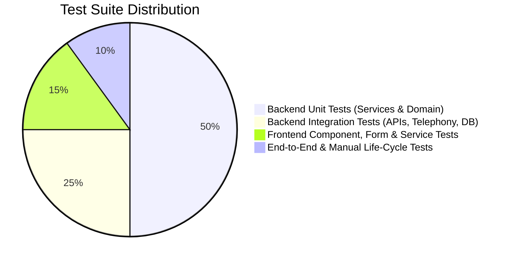
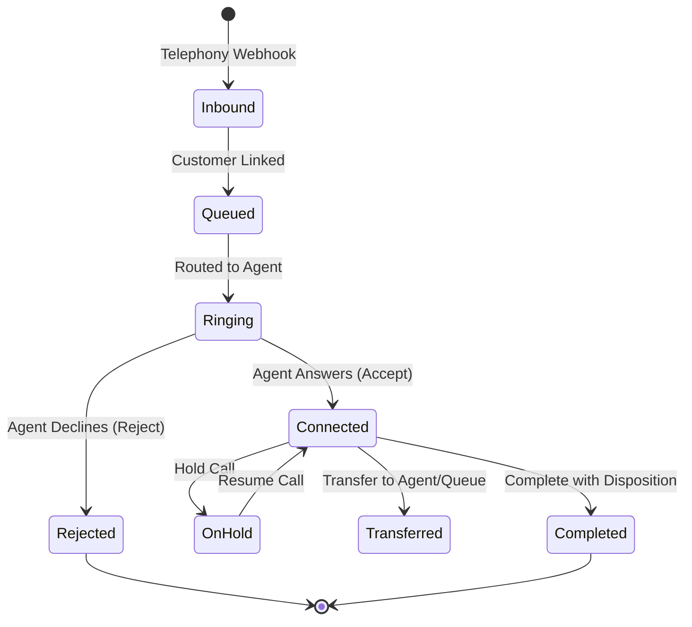

# FalaqFood Call Center - Professional Test Strategy & Quality Assurance Plan

## 1. Executive Summary & Quality Objectives

The **FalaqFood Call Center** is an enterprise multi-channel call center platform serving the food and catering industry. The system integrates customer relationship management (CRM), automated call distribution (ACD), intelligent queue routing, real-time telephony state machines, agent workspaces, supervisory dashboards, and audit-compliant reporting.

### Primary Quality Goals
1. **Zero Downtime Call Handling**: Ensure inbound and outbound call lifecycles transition predictably through state machines without orphaned sessions or phantom calls.
2. **Deterministic Routing & Queue Integrity**: Ensure calls are enqueued, prioritized, and dispatched to agents deterministically with zero queue position collisions or race conditions.
3. **Data Integrity & Audit Compliance**: Every customer interaction, status change, call transfer, hold/resume, and disposition must be audited with tamper-evident logs and user attribution.
4. **Resilient Real-Time Synchronization**: WebSockets (SignalR) events must reliably synchronize agent states, incoming call notifications, queue updates, and operational dashboards across concurrent client sessions.
5. **Security & Role-Based Access Control**: Strict enforcement of authentication (JWT Bearer tokens), role authorization (`Admin`, `Supervisor`, `Agent`), account lockouts, and telephony webhook signature verification.

---

## 2. Test Pyramid & Coverage Targets

Our quality architecture adheres to a structured test pyramid designed for fast feedback, deterministic reliability, and high defect detection efficiency.

| Layer | Focus Areas | Framework & Tools | Coverage Target |
| :--- | :--- | :--- | :--- |
| **Unit Tests (Backend)** | Domain entities, business logic, service algorithms, validation, routing strategies | xUnit, Moq, EF Core InMemory | **> 90%** |
| **Integration Tests (Backend)** | REST controllers, DB persistence, SignalR hubs, Telephony webhooks, Security & Auth | `WebApplicationFactory<Program>`, EF Core | **> 85%** |
| **Unit & Component Tests (Frontend)** | Angular services, HTTP interceptors, route guards, reactive forms, page components | Jasmine, Karma, ChromeHeadless | **> 85%** |
| **End-to-End & Manual Scenarios** | Complete call center lifecycle from customer lookup to post-call analytics | Browser UI, Telephony Simulators, SQL Scripts | **100% Critical Paths** |

---

## 3. Backend Testing Strategy

### 3.1 Unit Testing Strategy
Backend unit tests validate business rules in isolation using fast in-memory dependencies and mock abstractions.

#### Scope of Service Unit Tests:
1. **CustomerService**:
   - Paged customer search by name, phone number, and email.
   - Exact phone number normalization and duplicate detection (`InvalidOperationException`).
   - Audit logging verification on customer creation, updates, and deletion.
   - Paged customer call history retrieval and detail aggregation.
2. **AgentService**:
   - Paged and filtered retrieval by agent status (`Available`, `Busy`, `Break`, `Offline`), team, and search term.
   - Atomicity of user account and agent profile creation.
   - Duplicate employee code and username prevention.
   - Status transition state-machine validation and real-time broadcast notification.
3. **CallService**:
   - Idempotency key handling ensuring duplicate requests return the original call instance.
   - Duplicate correlation ID rejection for inbound calls without idempotency keys.
   - Call creation for inbound (`Queued`) and outbound (`Ringing`) directions.
   - Transition validation: duplicate state transitions ignored idempotently.
   - Hold, resume, transfer, notes updates, and completion lifecycle transitions.
   - Timeline event logging with chronological integrity.
4. **RoutingService**:
   - Deterministic selection of the longest idle agent (`AgentStatus.Available`).
   - Graceful fallback: automatic queueing when no agents are eligible.
   - Strategy validation: `OldestAvailable`, `LeastBusy` (tie-breaking on active calls, today completed calls, idle duration), and `RoundRobin`.
5. **QueueService**:
   - Queue creation, priority weighting, and queue status toggling.
   - Enqueueing with sequential position assignment.
   - Queue compaction and position re-indexing upon entry cancellation or abandonment.
   - Real-time queue metrics calculation (waiting calls, average wait time, active queues).
6. **DispositionService**:
   - Active vs. inactive disposition filtering.
   - Code normalization (case-insensitivity, whitespace trimming).
   - Duplicate disposition code rejection.
   - Business rule enforcement: requiring follow-up datetime and wrap-up notes.

### 3.2 Integration Testing Strategy
Backend integration tests run against an in-memory ASP.NET Core test host (`WebApplicationFactory<Program>`) with full dependency injection, EF Core database context, authentication middleware, and validation filters.

#### Coverage of 16 Critical Workflows:
1. **Login**: Valid credentials generate JWT access tokens; invalid passwords and missing users return HTTP `401 Unauthorized`; locked accounts return HTTP `423 Locked`.
2. **Authorization**: Route protection testing across `Admin`, `Supervisor`, and `Agent` roles; unauthenticated requests return `401`; unauthorized roles return `403 Forbidden`.
3. **Customer CRUD**: Full REST lifecycle (`POST /api/v1/customers`, `GET /api/v1/customers/{id}`, `PUT /api/v1/customers/{id}`, `DELETE /api/v1/customers/{id}`, `GET /api/v1/customers`).
4. **Agent CRUD**: Administrative agent lifecycle (`POST /api/v1/agents`, `GET /api/v1/agents`, `PUT /api/v1/agents/{id}`, `PUT /api/v1/agents/{id}/status`).
5. **Incoming Call**: Inbound webhook processing (`POST /api/v1/telephony/inbound`), phone lookup, customer linking, and initial queue entry.
6. **Outgoing Call**: Outbound initiation (`POST /api/v1/calls/outgoing` & `/api/v1/telephony/outgoing`) verifying outbound state machine transition to `Ringing`.
7. **Routing**: Automated routing engine dispatching incoming calls to available agents via selected routing strategy.
8. **Queue**: Dynamic queue entry management, priority escalation, and queue statistics reporting (`GET /api/v1/queues/summary`).
9. **Accept**: Agent accepts assigned call (`POST /api/v1/telephony/calls/{id}/answer`); call transitions to `Connected`, agent transitions to `OnCall`.
10. **Reject**: Agent declines call (`POST /api/v1/telephony/calls/{id}/reject`); call transitions to `Rejected` and ends or requeues.
11. **Hold**: Connected call placed on hold (`POST /api/v1/telephony/calls/{id}/hold`); call status updates to `OnHold`.
12. **Resume**: Call resumed (`POST /api/v1/telephony/calls/{id}/resume`); call status restores to `Connected`.
13. **Transfer**: Blind and warm transfer (`POST /api/v1/telephony/calls/{id}/transfer`) to target agent or queue.
14. **Disposition**: Post-call classification (`POST /api/v1/dispositions`) and validation of required notes and follow-up timestamps.
15. **Completion**: Call completion (`POST /api/v1/telephony/calls/{id}/complete`), duration calculation, agent status release to `Available`.
16. **Reports**: Operational dashboard aggregation (`GET /api/v1/reports/operations`), call history filtering (`GET /api/v1/reports/calls`), and agent performance metrics.

---

## 4. Frontend Testing Strategy

Frontend testing verifies that the Angular Single Page Application correctly presents state, enforces client-side validation, handles network errors gracefully, and responds to real-time events.

### 4.1 Services
- Mock `HttpClient` (`HttpClientTestingModule` / `HttpTestingController`) verifying endpoints, HTTP methods, headers, and request/response payloads.
- Services covered: `AuthService`, `CustomerService`, `AgentService`, `CallService`, `QueueService`, `DispositionService`, `ReportsService`, `TelephonyService`.

### 4.2 Route Guards & HTTP Interceptors
- **AuthGuard**: Validates user token presence and role permissions; redirects unauthenticated users to `/login` and unauthorized users to `/unauthorized`.
- **AuthInterceptor**: Automatically injects `Authorization: Bearer <token>` into outgoing HTTP requests; handles HTTP 401 responses by triggering logout or session refresh.

### 4.3 Reactive Forms Validation
- **Login Form**: Required username and password validation; disabled submit button during pending submission.
- **Customer Form**: Required full name and phone number; email format validation; CRM identifier formatting.
- **Agent Form**: Employee code format, username, password complexity, and role selection validation.
- **Queue Form**: Queue name required, priority bounds (1 to 10).
- **Disposition Form**: Dynamic validation enforcing future date/time selection when `requiresFollowUp` is true, and non-empty notes when `requiresNotes` is true.

### 4.4 Components
- **LoginComponent**: Form submission, authentication dispatch, error message banner on 401.
- **CustomersComponent**: Real-time debounce search, pagination navigation, modal form interaction.
- **AgentsComponent**: Filter by status and team, open creation modal, display agent table.
- **AgentDashboardComponent**: Status badge display, status dropdown change triggering backend update, incoming call notification banner.
- **ActiveCallComponent**: Live call duration timer, hold/resume toggle buttons, transfer dialog, disposition modal submission.
- **QueueManagementComponent**: Queue card metrics, waiting calls table, priority change action.
- **ReportsComponent**: Date range filters, operational metrics cards, call volume breakdown.

---

## 5. Telephony & Real-Time SignalR Test Protocol

### 5.1 Telephony State Machine Verification

- **Webhook Signature Security**: Every inbound telephony webhook is verified against `Telephony:WebhookSecret` using HMAC-SHA256 signature headers.
- **Replay Protection**: Replay attacks are mitigated by rejecting payloads with expired timestamps or duplicate webhook delivery IDs.

### 5.2 SignalR Hub Testing
- Tests verify that hub clients receive targeted messages:
  - `incoming-call`: Broadcast to specific agent when a call is assigned.
  - `call-updated`: Broadcast to relevant agents and supervisors upon state transitions.
  - `agent-status-changed`: Broadcast to supervisory dashboards when an agent toggles status.
  - `queue-updated`: Broadcast to queue monitors when calls enter or leave queues.

---

## 6. Defect Severity & Quality Gates

### 6.1 Defect Severity Classification
| Severity | Description | Resolution SLA |
| :--- | :--- | :--- |
| **P0 - Blocker** | Call drop, state machine deadlock, security leak, data corruption | Immediate / Blocks Release |
| **P1 - Critical** | Routing failure, queue ordering corruption, auth token failure | < 4 Hours |
| **P2 - Major** | Report metric inaccuracy, UI modal glitch, non-blocking telemetry delay | < 24 Hours |
| **P3 - Minor** | Cosmetic UI defect, formatting issue, non-critical log warning | Next Sprint |

### 6.2 Production Release Gate Criteria
All of the following criteria must be satisfied prior to declaring the project production-ready:
1. **Automated Backend Tests**: 100% passing tests (zero failures, zero skipped tests).
2. **Automated Frontend Tests**: 100% passing tests across all components, forms, and services.
3. **End-to-End Verification**: Complete execution of the 14-step manual E2E scenario with sign-off.
4. **Zero P0 / P1 Defects**: No unresolved blocker or critical issues.
5. **Database Migration Consistency**: Clean execution of EF Core migrations from empty database to current schema.
